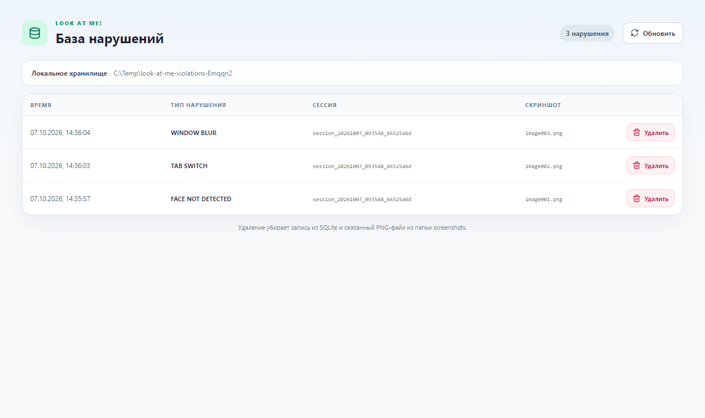

# Local violation evidence

Look At Me! stores only screenshots of confirmed, scored violations. It does not record the full test or create WebM video files.

## Physical location

The default Windows location is:

```text
%USERPROFILE%\Documents\LookAtMeViolations\
├── violations.db
└── screenshots\
    ├── image001.png
    ├── image002.png
    └── ...
```

`LOOK_AT_ME_DATA_DIR` may override the root for isolated automated tests. Production startup does not set this variable, so the helper uses the Documents path above.

## SQLite schema

The helper creates one table:

```sql
CREATE TABLE violations (
    id INTEGER PRIMARY KEY AUTOINCREMENT,
    event_id TEXT NOT NULL UNIQUE,
    session_id TEXT NOT NULL,
    violation_time TEXT NOT NULL,
    violation_type TEXT NOT NULL,
    screenshot_name TEXT NOT NULL UNIQUE,
    created_at TEXT NOT NULL
);
```

The user-facing relation is intentionally simple: `violation_time` + `violation_type` + `screenshot_name`. `event_id` prevents the same Event Engine event from creating duplicate files, and `session_id` keeps evidence attributable when several sessions share the same database.

## Readable evidence page

The popup button **Открыть базу нарушений** opens the bundled `evidence.html` extension page. The page requests up to 1,000 current rows through the service worker and Native Messaging host, then displays local time, violation type, session ID, and screenshot filename in a normal table. It never parses the binary SQLite file in the browser and does not expose a localhost server.

**Удалить** asks for confirmation and sends the selected `event_id` to the helper. Under an immediate SQLite transaction, the helper moves the matching PNG to a temporary same-directory name, removes the row, commits, and then removes the temporary file. If the database operation fails, it rolls back and restores the PNG. A successful response removes the row from the page immediately. **Обновить** reads SQLite again.



## Capture path

```text
CV / browser / system observation
        ↓
single Event Engine
        ↓ confirmed scored violation
visible test page + current live-camera frame
        ↓ offscreen canvas composition
single PNG with student camera inset
        ↓ PNG base64 over Native Messaging
local_evidence_store.py
        ├─ atomic screenshots/imageNNN.png write
        └─ SQLite transaction linking time, type and filename
```

The composite keeps the test page as the background and places a mirrored, labeled live-camera inset in the lower-right area so the violation context and student are visible together. The filename number comes from SQLite's monotonic row ID, so a restart or new proctoring session does not overwrite older screenshots. The helper accepts only bounded payloads with the PNG signature. It writes a temporary file, calls `fsync`, and atomically replaces the final filename before committing the database row. A failed transaction removes the incomplete image.

## Verification

```powershell
pnpm typecheck
pnpm test
python -m unittest discover -s tests -v
python scripts/test_native_agent.py --exercise-storage
pnpm build
pnpm test:extension-runtime
```

The extension runtime smoke starts the actual unpacked MV3 build, closes and reopens the popup, produces real browser violations, verifies non-empty PNG and SQLite files, opens the evidence page, and deletes one record through its real button. The test then verifies that the row disappears from the page and its matching PNG disappears from disk. Use `LOOK_AT_ME_TEST_DATA_DIR` to direct that runtime test to an explicit evidence root. Chrome 137+ branded builds removed automated `--load-extension`; use Chrome for Testing through `LOOK_AT_ME_CHROME` for this automated test.

## Limits

- Chrome cannot write SQLite or arbitrary Documents files itself, so the registered Native Messaging helper is required.
- `captureVisibleTab()` requires the manifest's `<all_urls>` host permission. Content-script injection remains restricted to HTTP(S), and protected browser pages are still unavailable.
- A browser/system screenshot captures Chrome's visible tab, not the Windows desktop or another application.
- Screenshots are local files. Inline image preview, filtering, retention limits, and cloud synchronization are not implemented in this phase.
